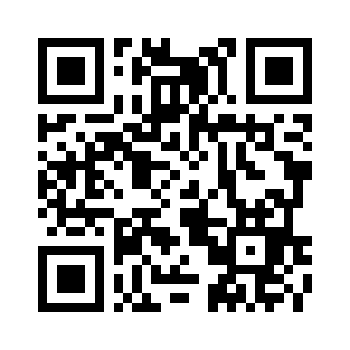

# Keon

Keon is a mobile-first Japanese and Polish learning app.

## Open Keon

**Live app:** https://mayok1921.github.io/Lang_Abr/

Scan this QR code on a phone:

## Install on iPhone

1. Open the live app in **Safari**.
2. Tap **Share**.
3. Tap **Add to Home Screen**.
4. Tap **Add**.

## Install on Android

Open the live app in Chrome and choose **Install app** or **Add to Home screen**.

## What Keon currently includes

- Japanese and Polish in one app
- Choose one or both languages
- Separate starting level for each language
- Quick placement test ("Test me")
- Learning goals: conversation, travel, reading, school/work, general fluency
- Separate progress by language and subject
- Guided next-lesson recommendations based on level, goals, and mastery
- Flashcards
- Multiple choice
- Japanese writing/tracing
- Comprehensible input
- Missed-card review
- Mastery and accuracy dashboard
- Polish pronunciation, basics, travel, grammar foundations, and school/everyday vocabulary
- Japanese hiragana, katakana, useful phrases, and basic kanji
- PWA support for iPhone and Android
- QR code for opening the live app on another device

## About the guide

Keon's guide currently uses local progress rules to choose from the **fixed curriculum**. It does not generate lessons. This keeps the curriculum controlled and lets a real AI recommendation layer be connected later without putting an API key into the public GitHub Pages code.

## Files

- `index.html` — app screens and styles
- `app.js` — curriculum, progress, placement test, and recommendation logic
- `manifest.json` — PWA configuration
- `service-worker.js` — offline/cache support
- `keon-qr.png` — QR code to the live app
- `icon-192.png`, `icon-512.png` — Keon app icons
